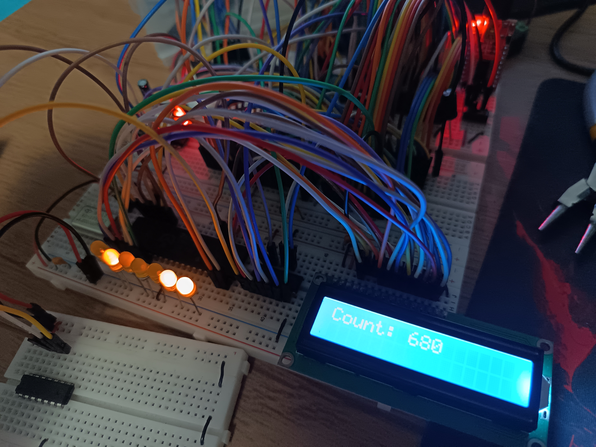
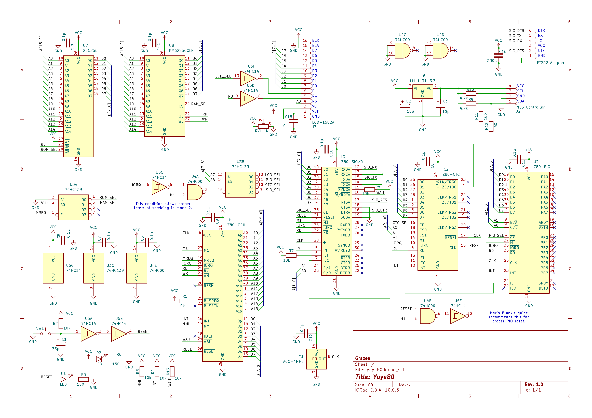
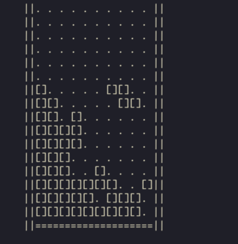

# Yuyu80

A homebrew Z80-based computer with a handful of I/O capabilities.

## Features

- **CPU:** Zilog Z80A @ 4 MHz
- **Memory:**
  - 32 KiB ROM
  - 32 KiB SRAM
- **I/O**:
  - Z80 PIO
    - Currently used to read an NES Classic Mini controller via I2C bit banging.
    - Bits 7-2 of port A and all of port B are so far unused.
  - Z80 SIO
    - Serial I/O for communicating with a PC (for example).
    - Can be used to use a terminal as output.
    - Port B is so far unused.
  - Z80 CTC
    - Generates system ticks for timing purposes.
    - Generates baud rate for the SIO.
  - LCD 1602A
    - Used mostly during initial development and for showing debug information somewhere other than via serial output.

## Schematic

Also found in the [kicad folder](kicad).

## Software

This repo currently has only 1 software example: a (mostly finished) [Tetris implementation](zetris). It uses the NES Classic Mini controller as input, and displays its output via serial (assuming the host terminal supports ANSI escape sequences).

## Address mappings

### Memory

|   Region    | Description |
| :---------: | :---------: |
| `0000-7FFF` | 32 KiB ROM  |
| `8000-FFFF` | 32 KiB RAM  |

### I/O

| Region |  Description  |
| :----: | :-----------: |
|  `00`  |  LCD control  |
|  `01`  |   LCD data    |
|  `40`  |  PIO data A   |
|  `41`  | PIO control A |
|  `42`  |  PIO data B   |
|  `43`  | PIO control B |
|  `80`  | CTC channel 0 |
|  `81`  | CTC channel 1 |
|  `82`  | CTC channel 2 |
|  `83`  | CTC channel 3 |
|  `C0`  |  SIO data A   |
|  `C1`  | SIO control A |
|  `C2`  |  SIO data B   |
|  `C3`  | SIO control B |

Unspecified I/O addressed are mirrors and should not be used.

## References

- [Ben Eater's 65c02 computer playlist](https://youtube.com/playlist?list=PLowKtXNTBypFbtuVMUVXNR0z1mu7dp7eH), which sparked this whole idea.
- [LM80C](https://github.com/leomil72/LM80C/), a major inspiration and guide for many aspects of this project.
- [Mario Blunk's "How To Program the Z80 Periphery Tutorial"](http://www.blunk-electronic.de/train-z/pdf/howto_program_the_Z80-SIO.pdf), a very helpful guide on both wiring and programming the SIO, PIO and CTC.
- [Z80 CPU User Manual](https://www.zilog.com/docs/z80/um0080.pdf)
